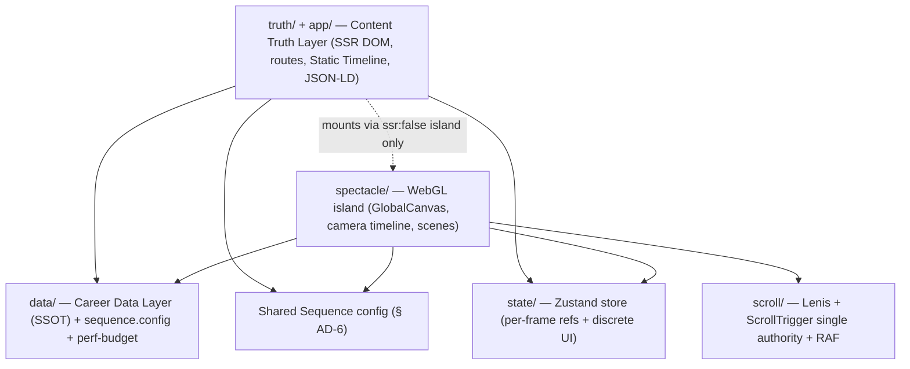
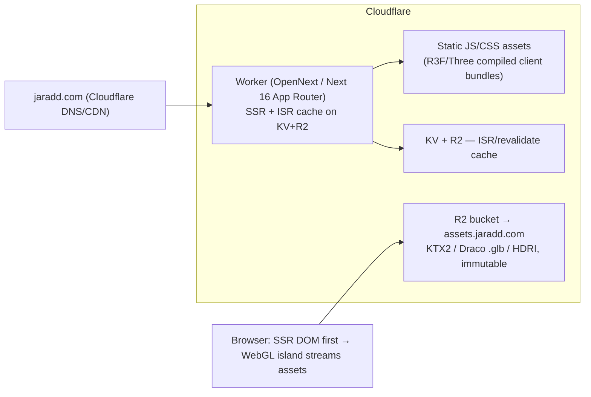
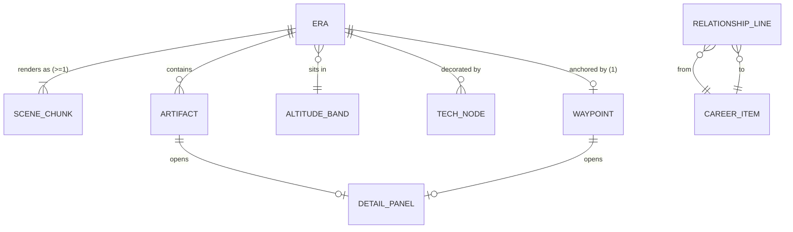

# Architecture Spine — Career Ascent

## Design Paradigm

**Layered progressive-enhancement over a single-source-of-truth data core, with a single-authority runtime.**

One **Career Data Layer** (the Model) projects into many surfaces — the SSR'd DOM **Content Truth Layer**, the WebGL **Spectacle Layer**, the **Static Timeline**, the per-era **routes**, and **JSON-LD**. The DOM projection is *the truth*; the WebGL projection is a *leaf enhancement* mounted on top of already-rendered truth and is never depended upon by it. At runtime, each cross-cutting concern that two independent scenes could each try to own — scroll, the animation loop, the camera, per-frame state, the sequence→distance mapping — has exactly **one authority**.

Layers map to top-level directories (see Structural Seed): `data/` (Model + config), `truth/` + `app/` (Content Truth Layer + routes), `spectacle/` (WebGL island), `state/` + `scroll/` (single-authority runtime).



*Dependency rule: arrows are the only permitted `import` directions. `truth/` must build and render fully with `spectacle/` absent — the dashed edge is the one-way dynamic-island mount boundary, not a code dependency. Nothing imports `spectacle/` statically.*

## Invariants & Rules

### AD-1 — Career Data Layer is the single source of truth `[ADOPTED]`
- **Binds:** FR-15, FR-16, FR-17; all surfaces (world, rail, panels, routes, Static Timeline, SEO, résumé)
- **Prevents:** the rail, a Detail Panel, a per-era route, and the SEO fallback each carrying a different date/title/tech for the same Era — including the *typed* divergence where two record types each legally store the same fact.
- **Rule:** every Era, Waypoint, Tech Node, artifact, date, summary, and link is defined once in the typed Career Data Layer under `data/career/` and read by every surface. No career fact is hardcoded in scene logic. **One canonical Era record, keyed by slug, owns `band` and the year range**; `EraSegment`, `CareerWaypoint`, `TechNode`, and the route all *reference the Era by slug and never restate* band or years (so `EraSegment.band` and a waypoint's altitude can never disagree). Adding/editing an Era updates all surfaces with no per-surface duplication.

### AD-2 — DOM is the truth; WebGL is an SSR-`false` island on top `[ADOPTED]`
- **Binds:** FR-10, FR-14; §10 SEO/CWV; UJ-1, UJ-4, UJ-5
- **Prevents:** primary content trapped in WebGL textures (SEO/a11y collapse); the canvas becoming the LCP element.
- **Rule:** all primary textual content exists in server-rendered HTML *before* hydration and *before* the canvas mounts. The Spectacle Layer is a single `next/dynamic({ ssr:false })` `'use client'` island mounted on already-SSR'd DOM behind a poster/skeleton. The LCP element is SSR hero/timeline text — never the canvas.

### AD-3 — Exactly one persistent GlobalCanvas; switch scenes by visibility `[ADOPTED]`
- **Binds:** FR-6, FR-7; §10 resilience
- **Prevents:** WebGL-context exhaustion (browsers cap ~8–16 and kill the oldest) and material-recompile hitches at era transitions.
- **Rule:** one `<Canvas>` fixed behind the scrolling document for the whole site — never a per-section/per-era canvas. Era scene-graph nodes stay mounted; switch active scenes via the `visible` prop, never conditional mount/unmount at runtime. (GPU texture/geometry residency is governed by AD-13/AD-14, not by unmounting.)

### AD-4 — Single scroll authority + single RAF loop `[ADOPTED]`
- **Binds:** FR-1, FR-2; §10 performance
- **Prevents:** two competing RAF loops and two scroll owners producing visible DOM↔WebGL jitter and desynced camera scrub; a `drei ScrollControls` overlay breaking the SSR/semantic truth layer.
- **Rule:** GSAP ScrollTrigger on the real (native / Lenis) document is the **only** scroll authority — no `drei ScrollControls` in the same route. Lenis runs `autoRaf:false`, driven from `gsap.ticker` (with `lagSmoothing(0)`); `ScrollTrigger.update()` fires on Lenis's scroll event. The R3F canvas uses `frameloop='demand'` with explicit `invalidate()` during scroll/tween/physics and `regress()` during interaction — zero renders when idle.

### AD-5 — State boundary: never `setState` in the frame/scroll loop `[ADOPTED]`
- **Binds:** all scenes/components; §10 performance
- **Prevents:** independently-built scenes each routing 60 fps updates through React's scheduler — the #1 R3F performance failure.
- **Rule:** per-frame values (camera position, `scrollProgress`, physics) live in refs or are read via `store.getState()` inside `useFrame`; **never** `setState`/`set` in `useFrame` or scroll callbacks. React re-render is reserved for **discrete UI state only** — `activeEra`, `qualityTier`, `reducedMotion`, panel open/close.

### AD-6 — One shared Sequence config drives both DOM heights and world offsets `[ADOPTED]`
- **Binds:** FR-1, FR-5, FR-6; §10 CLS
- **Prevents:** the DOM section heights and the 3D waypoint offsets being hand-tuned separately and drifting apart (visual desync + layout shift).
- **Rule:** the Sequence-to-Distance Mapping in `data/sequence.config.ts` is the single origin for **both** DOM section heights **and** world waypoint offsets. Both are *derived* from it; neither is authored independently. Constants (`SPAN_MIN/MAX/PER_YEAR`, camera/travel/physics caps) live here (see addendum §C).

### AD-7 — One scrubbable camera timeline; code-authored GSAP is the runtime authority
- **Binds:** FR-1, FR-2, FR-3, FR-4, FR-21
- **Prevents:** free-scroll camera motion and click-to-launch tweens diverging into two camera systems that fight for control.
- **Rule:** the whole `ground → orbit → deep-space` journey is authored as **one** timeline. `free-scroll` maps `scrollProgress → timeline position` (`tl.seek(...)`); `waypoint-jump` tweens the **same** playhead to a target offset (`power3.inOut`, duration scales with sequence distance, bounded, interruptible) — it never hijacks the scroll authority. The runtime authority is a **code-authored GSAP timeline**. `[ASSUMPTION: Theatre.js is at most an optional dev-only authoring aid (NODE_ENV-guarded, tree-shaken, baked to a checked-in state.json), never a runtime dependency — recommended given @theatre/r3f staleness; confirm (§8 Q13).]`

### AD-8 — The world axis is the Career Sequence, not raw calendar year `[ADOPTED]`
- **Binds:** FR-1, FR-5, FR-6; Glossary (Career Sequence, Primary Track)
- **Prevents:** overlapping tenures (Warby⊂ClassPass, Splash overlapping ClassPass/Justworks, ACD overlapping Justworks) producing a non-single-valued `year→distance` function and colliding altitudes.
- **Rule:** the world is laid out along a **monotonic Career Sequence** of non-overlapping segments. The year is a *derived, non-decreasing label*, not the axis. The **Primary Track** is single-valued at every sequence position; concurrent roles co-locate as artifacts within their Era's band, never claiming their own span. Altitude Band is non-decreasing along the sequence. Prologue = fixed pre-roll at the bottom; Axioms = fixed atemporal anchor at the top.

### AD-9 — Reduced-Motion and Fidelity Tier are orthogonal, first-class, degrade-to-truth modes `[ADOPTED]`
- **Binds:** FR-25, FR-26, FR-28, FR-33; §10 accessibility & adaptive quality
- **Prevents:** a11y treated as "animations off" bolted on late; a scene assuming full effects and stuttering or seizing on a constrained device; ambiguity over whether the canvas even mounts.
- **Rule:** spectacle is **OFF by default in code**, enabled only when `prefers-reduced-motion` does **not** match. A **single motion flag** gates *all* camera launch/parallax/physics, re-evaluated on the `matchMedia` change event. **Fidelity Tier (0–3)** is the orthogonal device/performance axis, set at boot by `detect-gpu`; its runtime auto-downgrade is owned by AD-13 (this AD does not re-specify the monitor). **Deterministic surface selection:** if `reduced-motion` **OR** Tier 0 **OR** no-WebGL2 **OR** `webglcontextlost` holds, the WebGL island is **not mounted (or is torn down)** and the **Static Timeline is the rendered surface** — reduced-motion never mounts a "still" canvas. Otherwise the island mounts at the resolved Tier. A persistent, keyboard-reachable in-UI reduce/pause toggle exists (OS setting alone does not satisfy 2.2.2).

### AD-10 — The Static Timeline is one component serving four jobs `[ADOPTED]`
- **Binds:** FR-25, FR-28; §10 SEO + resilience
- **Prevents:** four divergent fallback implementations (SEO body, `<noscript>`, reduced-motion, capability fallback) drifting out of parity with the world.
- **Rule:** a single Static Timeline artifact **is** the SEO/indexable body, the `<noscript>` mirror, the Reduced-Motion Mode, and the low-end/mobile/context-lost fallback. It is SSR'd, works with JS disabled and WebGL unavailable, and exposes every Era, Detail Panel, résumé, and link the World does. It is not a separate "lite" page.

### AD-11 — Routing authority: real per-era routes; deep-link cold-load places, never launches `[ADOPTED]`
- **Binds:** FR-21; §10 SEO
- **Prevents:** hash routing that starves SEO; a deep link replaying the from-ground launch (delaying LCP, risking CLS); ambiguous Back/404 behavior as the site pivots.
- **Rule:** every Era (and key project/essay) is a real History-API route (`/journey/[era]`) with its own SSR'd title/meta/canonical/JSON-LD **and** OG/Twitter card + preview image — **no** hash/fragment routing. **Cold-load places** the camera at the Waypoint with its panel open (reduced-motion anchors instantly); only **in-session** selection triggers the AD-7 launch tween. All history writes go through the single navigation authority (AD-18): `replaceState`-track on scroll-settle, `pushState`-select on explicit Waypoint selection — never called ad-hoc by a scene. Back after a deep-link entry is defined. Unknown/renamed slug → graceful 404 into the Static Timeline; previously-published slugs stay resolvable via an alias/redirect policy. Root vs per-era content is differentiated and canonicalized so they don't self-compete in ranking.

### AD-12 — Cloudflare client/server split; 3D binaries in R2 `[ADOPTED]`
- **Binds:** §10 performance; §13 platform; deployment
- **Prevents:** R3F/Three pulled into the server Worker bundle and blowing the ~10 MiB gzip limit (the most-reported OpenNext failure); asset-heavy egress cost.
- **Rule:** R3F/Three and all scene code are **client components only**, compiled to static JS assets — never imported into the server Worker bundle (verify with the ESBuild bundle analyzer). Large 3D binaries (KTX2 textures, Draco/Meshopt `.glb`, HDRIs) live in **Cloudflare R2** behind a custom asset domain (`assets.jaradd.com`), content-hashed filenames, `Cache-Control: public, max-age=31536000, immutable`, single-range (206) requests. App is Next.js (App Router) via `@opennextjs/cloudflare` on Workers (Node runtime; ISR cache on KV + R2). `@cloudflare/next-on-pages` is **not** used (deprecated). Secrets only via env/Cloudflare bindings.

### AD-13 — Performance budget is a checked-in CI gate; one runtime quality monitor `[ADOPTED]`
- **Binds:** FR-30 (CI green on `main`); §10 GPU/asset budgets & adaptive quality; SM-C1
- **Prevents:** each independently-built scene individually "fine" but the *resident sum* silently blowing draw-call/triangle/texture/bundle budgets while CI stays green; two competing quality-downgrade owners.
- **Rule:** `data/perf-budget.json` is the single origin of budgets (draw calls ≤ 50 mobile / 100 desktop; triangles ≤ 500k; **peak resident GPU texture memory** ≤ 256–384 MB mobile / ≤ 1 GB desktop, all textures KTX2/mipmapped; first WebGL load < 6 MB, hard cap ~15 MB; Worker bundle under limit; DPR ≤ 2). **CI fails on regression** against it — and the budget is asserted against the **resident window sum** (AD-14), not just per-asset size, so no scene passes alone while the traversal total overflows (the Rich-Results/JSON-LD check runs here too). AD-13 owns the **single runtime quality monitor**: `PerformanceMonitor` with hysteresis, shed order postprocessing → particles → DPR → LOD; if avg FPS < 40 for > 2 s it auto-downgrades one Fidelity Tier (AD-9 defers to this; no other module downgrades quality). Instancing (`InstancedMesh`/`BatchedMesh`) for all stars/particles/repeated nodes; per-era lazy load, preload only the adjacent era.

### AD-14 — Scene contract: data-driven, composable, fallback-bounded, anachronism-free `[ADOPTED]`
- **Binds:** FR-6, FR-7, FR-8, FR-9, FR-33, FR-22–FR-24; §10 maintainability
- **Prevents:** N bespoke per-era render pipelines a solo builder can't maintain; a jumped-to or deep-linked Era blanking the canvas while R2 assets stream; anachronistic set pieces; unbounded GPU memory growth across the ascent.
- **Rule:** every Era maps to ≥ 1 Scene Chunk (`<Name>Scene`), **data/config-driven** and assembled from **shared composable rendering modules** (materials, particle systems, band transitions) under `spectacle/rendering/` — not per-era pipelines; new eras are added by config. The **adjacent-era window is defined once** in `data/sequence.config.ts` in Career-Sequence `order` units (e.g. `±1`); a **single residency authority** (not each scene) disposes/reloads GPU textures/geometry outside that window (nodes stay mounted per AD-3). Each scene has a **bounded loading state + degraded per-scene fallback** (low-LOD/billboard or the Era's panel content). **Failure taxonomy is pinned:** per-scene asset timeout/fetch-failure/R2-down → that scene's degraded fallback, isolated (never the coarse path); only boot Tier 0 / no-WebGL2 / `webglcontextlost` → the coarse Static-Timeline path (AD-9). Set pieces must match that Era's Tech Nodes (no MCP motif on the ground). **Physics sub-rule (post-MVP):** Rapier scoped to active-era accent props only, world paused off-screen, disabled at Tier ≤ 1 / reduced-motion, per-tier body caps (addendum §C `PHYSICS_BODY_CAP`), raycasting throttled ~30 Hz.

### AD-15 — Source-as-Exhibit gates: the repo is a checkable exhibit
- **Binds:** FR-29, FR-30, FR-31, FR-32, FR-35; UJ-5, SM-5; §16
- **Prevents:** the "directed AI to my standard" claim resting on "you can tell"; one leaked secret inverting the entire credibility signal; easter eggs silently deleted; a fresh agent unable to find the right module.
- **Rule:** the repo ships (a) `CONVENTIONS.md` (module boundaries, naming, abstraction seams, doc expectations) **enforced** by CI import-boundary/module-graph rules + lint/format + doc-presence checks, green on `main`; (b) a **gitleaks secret-scan as a hard publish gate**, with commit *history* verified clean before the repo is public; (c) `AGENTS.md`/`CLAUDE.md` + per-module docs passing a cold-start locatability test; (d) **≥ 1 source-resident easter egg** guarded by a CI test so it can't be accidentally removed (and not spoiled by a public doc); (e) a published **build case study** (the falsifiable AI-direction evidence). `[ASSUMPTION: repo ships a source-available "look, don't reuse" LICENSE — e.g. PolyForm Noncommercial or a custom view-only notice — since §5 says "not an OSS product" yet UJ-5 invites inspection; confirm flavor (§4.8).]`

### AD-16 — Accessibility is a first-class launch invariant, not a mode `[ADOPTED]`
- **Binds:** FR-27; §10 accessibility cluster; §6.1 launch gate; UJ-4
- **Prevents:** independently-built scenes each rolling their own (or no) keyboard/semantics/contrast handling; a11y treated as covered by AD-9's reduced-motion alone.
- **Rule:** every Era is a real focusable `<button>/<a>` in logical DOM order, Enter/Space-activatable, firing the **same** navigation as a click — **never raycast-only** selection; a skip-link is the first tab stop → `<main>`; heading order is `h1` (name) → `h2` (per era); no keyboard trap in the canvas. **Flash-safety is a hard gate that applies even in full-motion** (WCAG 2.3.1-A): no launch/bloom/ignition/strobe effect flashes > 3×/sec at large area / high luminance — verified with PEAT in CI. The focus indicator is never `outline:none`; it renders **above** the canvas with ≥ 3:1 contrast legible on **both** bright-cloud and deep-space backdrops (halo/double-outline, not color-only), and the focused element is never obscured (2.4.11). All persistent Content Truth Layer text (HUD, Rail, panel chrome) holds ≥ 4.5:1 against the **worst-case** backdrop across the ascent (scrim/plate or luminance-adaptive). Current Era/year is exposed to AT as a **polite ARIA live region**, announced on scroll-settle and Waypoint arrival. Target Size (2.5.8), Reflow at 400% (1.4.10), and forced-colors/`prefers-contrast` for the DOM layer are handled. **CI includes an automated a11y gate** (axe on the SSR DOM + the PEAT flash check) alongside the AD-13/AD-15 gates.

### AD-17 — One Detail-Panel & focus controller `[ADOPTED]`
- **Binds:** FR-11, FR-23, FR-27
- **Prevents:** two panels open at once; a 3D-artifact selection rolling its own handler that can't restore focus to the trigger (WCAG 2.4.3); the World and the Static Timeline opening panels differently.
- **Rule:** a single `activePanel` store slice and one panel controller own opening/closing Detail Panels; **at most one panel is open**. Opening moves focus into the panel; closing restores focus to the triggering element; panels are keyboard-dismissable (Esc). A selected 3D Artifact/Waypoint calls this controller — it does **not** implement its own focus handling — so the World, the Static Timeline, and deep-link cold-load all open panels through the **same** path with identical content from the Career Data Layer (AD-1).

### AD-18 — Single navigation/history authority `[ADOPTED]`
- **Binds:** FR-3, FR-19, FR-21; reconciles AD-4 ↔ AD-11
- **Prevents:** the scroll authority (AD-4), the rail, and the Next.js router each writing history/position and racing — `replaceState`-on-scroll clobbering a rail `pushState`, or raw History desyncing the router so "Back is defined" fails.
- **Rule:** all URL/history writes go through **one** navigation module built on the Next.js router; scroll-settle position updates **and** rail/Waypoint selections both call it (it alone chooses track-`replaceState` vs select-`pushState`). Scenes, the rail, and the HUD **never** call `history.*` directly. The relationship is **one-way**: a route change sets the camera/scroll target (via AD-7's playhead); camera/scroll motion never rewrites the route except through this module on settle.

### AD-19 — Single analytics event schema authority `[ADOPTED]`
- **Binds:** FR-34; SM-2, SM-3, SM-4, SM-5
- **Prevents:** the World, the Rail, and the Static Timeline emitting the same success-metric event under divergent names/shapes — making the **primary** metric SM-2 (scroll-depth vs jump-arrival) uncomputable.
- **Rule:** one typed event registry and one `track()` are the only way any surface emits analytics; every SM event is keyed by Era **slug** and conforms to the shared schema. **Scroll-traversal arrival and jump arrival are two distinct named events** (so SM-2 is two clean numbers); résumé download, outbound/repo click, and share/revisit are named once. `track()` honors DNT/GPC, drops events on declined consent (noted, not hidden), and no surface emits an ad-hoc event name.

## Consistency Conventions

| Concern | Convention |
| --- | --- |
| **Naming** | Glossary terms verbatim in code, data, and routes — no synonyms. Motion Mode literals exactly `free-scroll` / `waypoint-jump` / `inspect`; Altitude Bands exactly `ground` / `low-atmosphere` / `clouds` / `stratosphere` / `orbit` / `deep-space`; Fidelity Tier is the 0–3 integer scale (0 = Static Timeline). Scene components are `<PascalCase>Scene` (e.g. `RadioLabScene`). Era `id`/route slug = stable kebab-case (`computer-vision`), aliased on rename, never reused. |
| **Data & formats** | Career Data Layer is typed TypeScript (`EraSegment`/`CareerWorldState` per addendum §C; `CareerWaypoint`/`TechNode` per addendum §D). **Canonical Era identity is the slug (`id === slug`)**, kebab-case, stable; `order` and `band` are read from the one Era record (AD-1), never recomputed per surface. Years are integers; the display label is derived, never stored per-position. `positionHint` is in **world units relative to the segment origin**; the segment's world-Y is owned by the `sequence.config` mapping (AD-6) — scenes never compute their own altitude. TechNode→Era membership is by **explicit Era assignment** (reconciled with the sequence axis, AD-8), not raw year-range overlap. Links are `{ label, href }`. SM events follow the AD-19 registry. Knowledge Graph output (post-MVP) must conform to this schema — it is a *producer*, never a renderer. Exposed email uses an anti-harvest measure (no raw `mailto` in markup). |
| **State & cross-cutting** | One Zustand store in `state/`. Per-frame reads via `getState()`/refs; components subscribe to **discrete** slices via selectors only (AD-5). `reducedMotion`, `qualityTier`, and `activePanel` are store flags read by both layers; `qualityTier` is written **only** by AD-13's monitor, `reducedMotion` only by the `matchMedia` listener, `activePanel` only by the AD-17 controller — one writer per slice. The AD-6 viewport basis (e.g. `100svh` / a single `window.innerHeight` read) is chosen once and shared. Config/secrets via env + Cloudflare bindings only; `.env*` git-ignored. Analytics is privacy-first, honors DNT/GPC, consent sequenced not to collide with the 3–5 s onboarding cue. A scene load error degrades to its fallback (AD-14) — it never throws to the canvas. |

## Stack

| Name | Version |
| --- | --- |
| TypeScript | 5.x |
| Next.js (App Router) | 16.2.x (current stable) |
| React | 19.x |
| `@opennextjs/cloudflare` (Workers adapter) | 1.20.x |
| Three.js (`three`) | 0.185.x |
| `@react-three/fiber` | 9.6.x |
| `@react-three/drei` | 10.7.x |
| `@react-three/rapier` (post-MVP) | 2.2.x |
| `gsap` + ScrollTrigger | 3.13.x (free, incl. all plugins) |
| `lenis` (`lenis/react`) | 1.3.x |
| `zustand` | 5.x |
| `@pmndrs/detect-gpu` | latest |
| `@react-three/postprocessing` | latest (R3F v9-compatible) |
| MDX (résumé + long-form) | via `@next/mdx` (Next 16-compatible) |
| Hosting | Cloudflare Workers (OpenNext) + R2 + KV; domain `jaradd.com`, assets `assets.jaradd.com` |

*Versions verified current 2026-07-16 (see memlog). The two `latest` pins (`detect-gpu`, `@react-three/postprocessing`) are lockfile-pinned and validated in a spike — `detect-gpu`'s benchmark corpus froze Dec 2025 (newer GPUs may misclassify at boot; mitigated by AD-13's runtime monitor), and some postprocessing effects (Godrays/Lensflare/FXAA) have React-19 quirks. `@react-three/rapier` is post-MVP — re-verify at build time. Three.js WebGPU path exists but is **not** on the launch baseline — see Deferred. The code owns these once it exists; this table is cold-start seed.*

## Structural Seed

```text
project-delorenj/
  app/                       # Content Truth Layer routes (SSR)
    layout.tsx               # SSR shell; mounts the WebGL island (ssr:false) + poster
    page.tsx                 # root experience (SSR Static Timeline first, then island)
    journey/[era]/page.tsx   # per-era deep-link routes (AD-11)
    resume/page.tsx          # MDX résumé → HTML (+ PDF export, same source)
  data/                      # Model + config (SSOT)
    career/                  # Career Data Layer: eras, waypoints, tech-nodes, relationships (AD-1)
    sequence.config.ts       # Sequence-to-Distance Mapping — drives DOM + world (AD-6)
    perf-budget.json         # CI-enforced budgets (AD-13)
  truth/                     # Content Truth Layer components (SSR-safe DOM)
    StaticTimeline/          # the one component, four jobs (AD-10)
    panels/  rail/  hud/     # Detail Panels, Timeline Rail, HUD
  spectacle/                 # WebGL island ('use client', imported only via the island boundary)
    GlobalCanvas.tsx         # the single persistent canvas (AD-3)
    cameraTimeline.ts        # one scrubbable GSAP timeline (AD-7)
    scenes/                  # per-Era Scene Chunks, data-driven (AD-14)
    rendering/               # shared composable modules: materials, particles, transitions
    physics/                 # Rapier scoped systems (post-MVP)
    quality/                 # detect-gpu tiering + PerformanceMonitor (AD-9/AD-13)
    post/                    # single EffectComposer (selective bloom)
  scroll/                    # Lenis + ScrollTrigger single authority + RAF wiring (AD-4)
  state/                     # Zustand store (AD-5)
  # Source-as-Exhibit (AD-15), repo root:
  CONVENTIONS.md   AGENTS.md   CLAUDE.md   LICENSE
  .github/workflows/         # perf-budget, gitleaks, boundary-lint, JSON-LD validation CI
```

### Deployment & environments



*Environments: **local** (`next dev` / `wrangler dev`) → **preview** (Workers preview deploy per branch) → **production** (`jaradd.com`). The secret-scan + perf-budget CI gates (AD-13/AD-15) sit before any deploy.*

### Core entities



*Names + relationships only; attribute shapes live in `data/career/` (types per addendum §D).*

## Capability → Architecture Map

| Capability / Area (PRD) | Lives in | Governed by |
| --- | --- | --- |
| 4.1 Career World & Motion Engine (FR-1–5) | `spectacle/cameraTimeline`, `scroll/`, `data/sequence.config` | AD-4, AD-6, AD-7, AD-8 |
| 4.2 Era Scenes & Worldbuilding (FR-6–9, 33) | `spectacle/scenes`, `spectacle/rendering` | AD-3, AD-14, AD-13 |
| 4.3 Content Truth Layer (FR-10–14) | `truth/`, `app/`, `data/career` | AD-1, AD-2, AD-17 |
| 4.4 Career Data Model & KG (FR-15–18) | `data/career` (+ offline KG producer, post-MVP) | AD-1; Conventions (schema) |
| 4.5 Navigation & Wayfinding (FR-19–21) | `truth/rail`, `truth/hud`, `app/journey/[era]` | AD-11, AD-18, AD-7 |
| 4.6 Physics & Artifact Interaction (FR-22–24) | `spectacle/physics` (post-MVP) | AD-14 (physics sub-rule), AD-9 |
| 4.7 Accessibility & Fallbacks (FR-25–28) | `truth/StaticTimeline`, `spectacle/quality`, `truth/panels` | AD-9, AD-10, AD-16, AD-17 |
| 4.8 Source-as-Exhibit (FR-29–32, 35) | repo root + `.github/workflows` | AD-15 |
| 4.9 Instrumentation & Consent (FR-34) | `truth/` (analytics registry), Conventions | AD-19; AD-16 (consent a11y) |
| §10 a11y launch gate | `truth/`, CI (axe + PEAT) | AD-16, AD-10 |
| §10 perf / adaptive quality | `data/perf-budget.json`, CI, `spectacle/quality` | AD-2, AD-9, AD-13 |
| §13 Platform / hosting | Cloudflare (Workers + R2 + KV) | AD-12 |

## Deferred

- **WebGPU at launch** — WebGL2-only baseline; no WebGPU-only paths. Three.js ships a WebGPU renderer but it is not the launch bet; revisit compute-particle paths post-telemetry (§8 Q16). *Reason: baseline-compatibility risk outweighs the gain pre-launch.*
- **Buy-vs-build the canvas/scroll rig** — the *topology* is fixed (AD-3/AD-4); the *implementation* is open: hand-roll the minimal single-GlobalCanvas + DOM-tunnel with drei primitives (leaning) vs adopt `@14islands/r3f-scroll-rig`. *Reason: that library is at 8.15.0 (~1 yr+ stale, React 19/zustand v5 compat unconfirmed vs our R3F v9 baseline) — resolve behind a throwaway spike, not upfront (§8 Q15).*
- **Knowledge Graph ingestion pipeline** (FR-18) — post-MVP, offline, tool-agnostic; MVP data is hand-authored. Its output must conform to the Career Data Layer schema. *Reason: it is a content-authoring aid, not a shipped surface.*
- **Full physics interaction build** (FR-22–24) — Phase 3 / post-MVP; the scope invariant is pre-committed in AD-14. An optional lightweight idle-drift teaser in MVP is a PM call (§8 Q6). *Reason: emotionally load-bearing but not needed to prove the loop.*
- **Visual Relationship Lines rendering** (FR-17) — MVP ships data + panel "why this matters later" notes; rendered lines post-MVP (§8 Q5). *Reason: high-delight, high-complexity; defer the render.*
- **Audio** — `[ASSUMPTION: muted-by-default, user-initiated, out of MVP]` (§8 Q11). *Reason: autoplay/a11y policy needs a decision; not on the critical path.*
- **Analytics vendor & production observability/RUM** — the event *schema* is fixed (AD-19); the concrete privacy-first vendor is unbound (§8 Q10), as is field-CWV/RUM collection (a §10 launch gate — the *what* is committed, the *mechanism* deferred), error tracking, and rollback procedure. *Reason: implementation choices within the AD-19 + Conventions constraints; bind them together with the vendor.*
- **Per-era fidelity treatments beyond the two signature bookends** — full 3D reserved for `ground` (BAE) and `orbit`→`deep-space` (AI/Axioms); transitional eras get lighter kinetic/particle/wireframe treatments `[ASSUMPTION, §8 Q12]`. *Reason: art-direction tuning belongs in experiential spikes (§16), not the spine.*
- **Mobile-spectacle fidelity tuning** — a genuine lower-fidelity mobile spectacle (Tier 1–2) is a pre-launch gate; the exact treatment is tuned per device against AD-13 budgets. *Reason: needs real mid-tier-device testing, not an upfront decision.*
