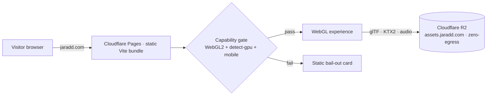

# Career Ascent — Architecture Spine (v2, Spectacle-First)

> **Supersedes** `architecture-project-delorenj-2026-07-16` (website-first: Next.js 16 + OpenNext, DOM-is-truth, SSR/SEO, WCAG launch gate). The **2026-07-18 pivot** flipped the north star: this is an **insane cel-shaded spectacle**, hand-distributed, **not** a findable/indexable website. What carries over is the **cel visual identity** (`DESIGN.md`) and the **world model** (eras → altitude bands → Career Sequence). What's gone: SSR, SEO, DOM truth layer, routing-as-truth, the accessibility launch gate, OpenNext.

## Paradigm

**One typed World-Data core → many cel-shaded scenes, under a single-authority client runtime, behind a capability gate.**

The experience is a continuous WebGL world you pilot by scrolling. There is exactly one canvas, one scroll authority, one camera timeline, one render pipeline, one runtime quality monitor. All content (eras, projects, tech, relationships) lives in one typed data module and is *projected* into 3D set-pieces and in-world panels — never hardcoded per scene. A pre-boot capability gate decides between booting the experience and rendering a single static **bail-out card**; that card is the only pixel that isn't WebGL.

## Invariants & Rules (violating one is how this drifts into chaos)

1. **One GlobalCanvas.** Scenes swap by visibility/LOD; the `<Canvas>` never remounts.
2. **One scroll authority (Lenis) + one camera timeline (GSAP ScrollTrigger).** Nothing else drives the camera. Waypoint jumps tween the *timeline playhead*, never spawn a second camera.
3. **One render loop, continuous.** `frameloop="always"` (this is a living world, not a document) — bounded by the perf budget + runtime tiering.
4. **State boundary.** Never `setState` in `useFrame`. World/UI state lives in zustand + refs; the loop mutates imperatively.
5. **One cel pipeline.** Every scene uses the shared toon material + stepped ramp + the single outline pass + halftone. No per-scene shader zoo.
6. **Data core is the only source of truth.** Band color, era title, year, project copy, tech nodes, relationships all read from one typed module. No per-surface copies.
7. **The bail-out is the only non-WebGL surface.** No SSR, no DOM truth layer, no static timeline. If WebGL/GPU can't deliver, the visitor gets the card — nothing half-rendered.
8. **Assets stream from R2 behind the boot sequence.** No giant synchronous load; the loading screen *is* the first spectacle beat.

## Stack

| Concern | Choice | Notes |
|---|---|---|
| Build/bundler | **Vite** + TypeScript | Replaces Next.js — no SSR needed. `[VERIFY @ scaffold]` pin latest Vite. |
| UI runtime | **React 19** | Thin shell around the canvas + in-world panels. |
| 3D | **React Three Fiber** (+ **three**) | Component scene graph. Versions carry from the 2026-07-16 research digest; re-pin at scaffold. |
| Helpers | **@react-three/drei** | `useGLTF`, `Html`, loaders, camera rigs, perf. |
| Post FX | **@react-three/postprocessing** | Outline pass, halftone/grain — the cel look. |
| Physics | **@react-three/rapier** | Floating artifacts/debris; tiered caps. |
| Camera/scroll | **gsap ScrollTrigger** on **lenis** | One scrubbable camera timeline; smooth virtual scroll. |
| State | **zustand** | World + UI store; refs for hot-path. |
| Capability | **@pmndrs/detect-gpu** | Boot tier + the capability gate. |
| Audio | WebAudio / Howler `[decide @ scaffold]` | Music bed + SFX; gesture-gated. |
| Assets | **glTF** (Draco/meshopt) + **KTX2** textures | Authored via the Blender→glTF pipeline. |
| Hosting | **Cloudflare Pages** (static app) + **R2** (assets, zero-egress) | `jaradd.com` / `assets.jaradd.com`. No OpenNext, no Workers-SSR. |

## Architecture Decisions

- **AD-1 — One typed World-Data core.** A single TS module holds Eras, Altitude Bands, the Career Sequence, Projects, Tech Nodes, and Relationships. Every scene, panel, waypoint, and the bail-out read it. `[ADOPTED]`
- **AD-2 — Career Sequence axis.** A monotonic Career Sequence (non-overlapping segments, duration-weighted, clamped) is the world's vertical axis; a `sequence.config` maps scroll progress → sequence position → camera playhead + active band + year label. Resolves overlapping tenures. `[ADOPTED]`
- **AD-3 — One GlobalCanvas.** Single `<Canvas>`; scenes load/unload by camera proximity via visibility + LOD, never by remounting the canvas. `[ADOPTED]`
- **AD-4 — One scroll + camera authority.** Lenis is the sole scroll source; a single GSAP ScrollTrigger timeline is the sole camera driver. Waypoint jump = interruptible tween of the timeline playhead. `[ADOPTED]`
- **AD-5 — State boundary.** No `setState` inside `useFrame`; zustand store + refs; the RAF loop mutates imperatively. `[ADOPTED]`
- **AD-6 — One cel render pipeline (the visual identity, enforced).** `MeshToonMaterial` + a shared stepped gradient ramp; exactly one outline technique (postprocessing outline pass, inverted-hull fallback at low tier); halftone/grain post FX; per-band grit→neon palette pulled from the data core + `DESIGN.md` tokens. Every scene speaks this dialect. `[ADOPTED]`
- **AD-7 — Capability gate + static bail-out.** A pre-boot check (WebGL2 present, detect-gpu tier ≥ threshold, coarse mobile check) chooses: boot the experience, or render the static **bail-out card** (name, one line, résumé + GitHub links, optional recorded video reel). The card is the only non-WebGL surface and the tier-0 floor. `[ADOPTED]`
- **AD-8 — Fidelity Tiers 0–3, deterministic.** detect-gpu sets the boot tier; one runtime FPS monitor with hysteresis auto-tiers. Tier controls the post-pass stack, particle/physics caps, DPR, LOD, shadows. Tier 0 = the bail-out. `[ADOPTED]`
- **AD-9 — Asset pipeline.** Cel-ready glTF (Draco/meshopt, KTX2 textures) authored/optimized via the Blender→glTF workflow, hosted on R2 (zero-egress), loaded through drei loaders under Suspense with per-scene byte/draw budgets, streamed behind the cel **boot sequence**. `[ADOPTED]`
- **AD-10 — In-world content projection.** Era/project/tech content renders as 3D set-pieces + in-world panels (drei `Html` or a React overlay layer above the canvas), always read from AD-1. Panels are game UI, not a DOM truth layer. `[ADOPTED]`
- **AD-11 — Navigation & camera (de-scoped).** One camera (the playhead). Waypoint jump tweens it. A lightweight URL hash MAY deep-link to an era (place the camera there on load, no full launch tween); this is a convenience, **not** a routing-truth or history authority, and never blocks the experience. `[ADOPTED]`
- **AD-12 — Physics.** rapier drives floating artifacts/debris with tiered body caps; bounded idle drift; disabled at low tier; never gates content. `[ADOPTED]`
- **AD-13 — Audio authority.** One audio manager (music bed + SFX), initialized on first user gesture (autoplay policy), persistent mute toggle, ducking during inspect. Audio is pure enhancement — the spectacle stands silent. `[ADOPTED]` *(newly viable now that the crawler constraint is gone.)*
- **AD-14 — Perf budget as a gate.** Draw calls, resident texture bytes, simultaneous full-screen post passes, and target FPS per tier are budgeted; a dev/CI check flags regressions; AD-8's monitor enforces at runtime. The outline/hull passes are counted. `[ADOPTED]`
- **AD-15 — Boot sequence & first frame.** Capability gate → branded cel boot/loading sequence (part of the show) → first scene. No blank-canvas flash. LCP/CLS/SEO are **not applicable** (not a website). `[ADOPTED]`
- **AD-16 — Minimal courtesy (reach, not compliance).** A single **reduce-motion toggle** calms camera shake/parallax (a motion-sick viewer is a viewer who bounces — same reach logic as the bail-out), and the bail-out card + core controls stay keyboard-operable. This is a light nicety, explicitly **not** the old WCAG launch gate. `[ADOPTED, minimal]`
- **AD-17 — Light instrumentation (optional).** If wanted, one analytics event schema (session start, waypoint arrival, completion) — no SEO/tracking obligation; may be omitted entirely. `[ASSUMPTION — confirm if any analytics at all]`

## Structural Seed

**Source tree (client-only Vite app):**
```
career-ascent/
  index.html                 # capability gate boots app OR renders bail-out
  src/
    main.tsx                 # gate → <BailOut/> | <Experience/>
    data/                    # AD-1 World-Data core (typed): eras, bands, sequence, projects, techNodes, relationships
    sequence/                # AD-2 sequence.config, scroll→position→playhead mapping
    world/
      GlobalCanvas.tsx       # AD-3 the single canvas
      scenes/                # per-era scenes (bookends full-3D; transitional lighter)
      pipeline/              # AD-6 celMaterial, outlinePass, halftone, ramp
      props/                 # reusable cel set-pieces (stations, tablets, waveforms)
    camera/                  # AD-4 gsap timeline + lenis binding, waypoint jump
    state/                   # AD-5 zustand store
    ui/
      hud/                   # in-world HUD (altitude tape, era readout, reticle)
      panels/                # AD-10 in-world detail panels (drei Html / overlay)
      BailOut.tsx            # AD-7 static card
      boot/                  # AD-15 cel boot sequence
    audio/                   # AD-13 audio manager
    perf/                    # AD-8/AD-14 detect-gpu, tier monitor, budget
  public/                    # tiny static (favicon, bail-out assets)
  # 3D/audio assets live on R2 (assets.jaradd.com), not in the bundle
```

**Deployment:**


**World-Data core (carried from v1, minus DOM concerns):**
```mermaid
erDiagram
  ERA ||--|| BAND : "sits in"
  ERA ||--o{ PROJECT : "contains"
  ERA ||--o{ TECHNODE : "showcases"
  PROJECT ||--o{ RELATIONSHIP : "through-line"
  TECHNODE ||--o{ RELATIONSHIP : "through-line"
  SEQUENCESEGMENT ||--|| ERA : "orders"
  ERA { string slug PK; string title; int seq; string band; string years }
  BAND { string id PK; string rampToken; string emissiveToken }
  SEQUENCESEGMENT { int index; float length; float altitude }
  PROJECT { string slug PK; string era; string blurb; string link }
  TECHNODE { string id PK; string label; string band; string motif }
  RELATIONSHIP { string from; string to; string semantic }
```

## Capability → Architecture Map (surviving capabilities)

| Capability | ADs |
|---|---|
| Pilot by scrolling | AD-2, AD-4, AD-5 |
| Jump to an Era | AD-4, AD-11 |
| Cel-shaded Era scenes | AD-3, AD-6, AD-9, AD-10 |
| World-Data SSOT | AD-1, AD-2 |
| Floating/physics artifacts | AD-12 |
| Runs on the target's machine (or bails out gracefully) | AD-7, AD-8, AD-14 |
| Soundtrack / game feel | AD-13 |
| Boot spectacle | AD-15 |

## Deferred / Open

- **Per-era 3D fidelity** — bookends (ground radio-lab, orbit→deep-space AI/Axioms) full-3D; transitional eras lighter (kinetic type / particle / wireframe). Confirm how many get full set-pieces.
- **Relationship-line visuals** (through-line filaments) — MVP-in or later.
- **Audio depth** — original score vs licensed bed; SFX scope. (AD-13 scope.)
- **Any analytics at all** (AD-17).
- **WebGPU** — deferred; WebGL2 baseline. Revisit if a target effect needs it.
- **Deep-link hash** (AD-11) — include in MVP or not.
